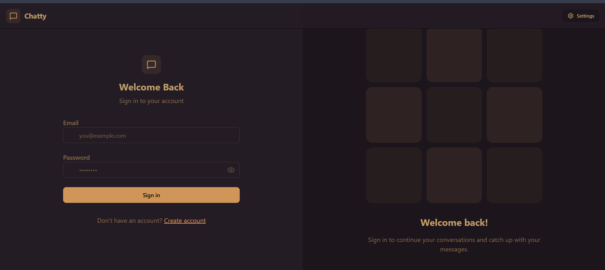
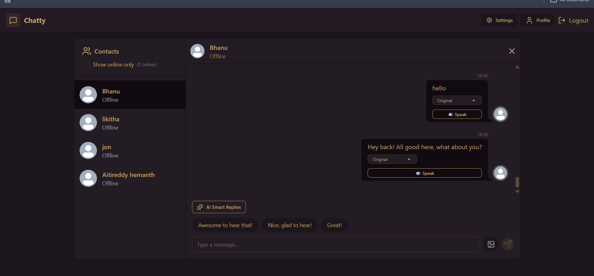
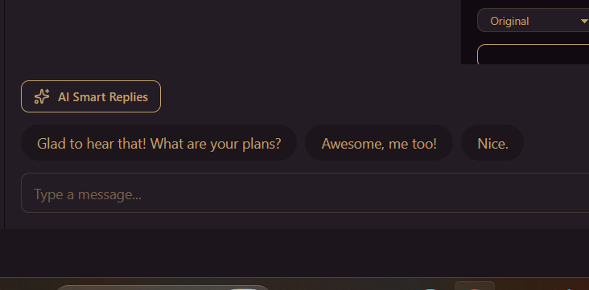
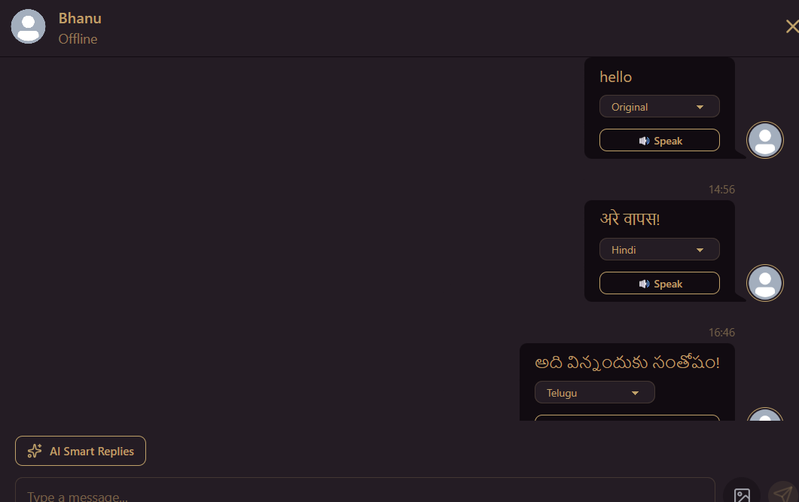
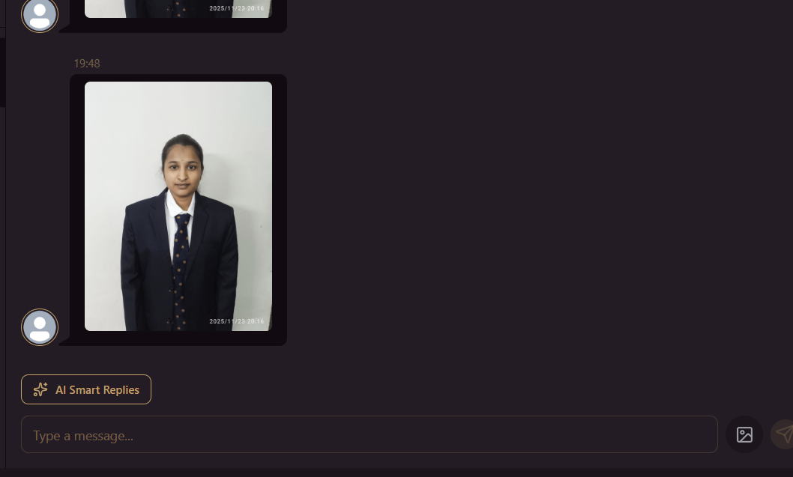

# 🌐 Real-Time Chat & Translation Application

A full-stack real-time chat application that enables users to communicate instantly with live messaging, AI-powered smart replies, multilingual translation, text-to-speech, image sharing, and online user tracking.

Built using the MERN Stack with Socket.IO for real-time communication and deployed using Docker on AWS EC2.

---

## 🚀 Features

### 🔐 Authentication
- User Registration
- User Login
- JWT Authentication
- Protected Routes
- Secure Password Hashing using bcrypt

### 💬 Real-Time Messaging
- Instant Messaging using Socket.IO
- Real-Time Message Delivery
- Online/Offline User Status
- Auto Scroll to Latest Messages

### 🌍 Translation
- Translate messages into multiple languages
- Switch between Original and Translated text
- Dynamic language selection

### 🤖 AI Smart Replies
- AI-generated quick reply suggestions
- One-click reply selection
- Faster conversations

### 🔊 Text-to-Speech
- Convert any message into speech
- Browser Speech Synthesis API integration

### 🖼 Image Sharing
- Upload and send images
- Cloudinary image storage
- Instant image preview

### 🎨 User Interface
- Modern Dark Theme
- Responsive Design
- Clean Chat Layout
- User Sidebar
- Message Timestamps

---

# 🛠 Tech Stack

## Frontend

- React.js
- Vite
- Tailwind CSS
- Zustand
- Axios
- Socket.IO Client

## Backend

- Node.js
- Express.js
- MongoDB
- Mongoose
- Socket.IO
- JWT
- bcrypt

## Deployment

- Docker
- Docker Compose
- AWS EC2
- GitHub Actions

---
## Live
http://18.208.197.41:5173/

# 📂 Project Structure

```
RealTimeChatApp
│
├── frontend
│   ├── src
│   ├── public
│   └── package.json
│
├── backend
│   ├── src
│   ├── routes
│   ├── controllers
│   ├── models
│   ├── middleware
│   └── package.json
│
├── docker-compose.yml
├── README.md
└── .env
```

---

# ⚙ Installation

## Clone Repository

```bash
git clone https://github.com/yourusername/RealTimeChatApp.git
```

```bash
cd RealTimeChatApp
```

---

## Backend Setup

```bash
cd backend
npm install
```

Create a `.env` file

```env
PORT=5001

MONGODB_URI=your_mongodb_uri

JWT_SECRET=your_secret_key

CLOUDINARY_CLOUD_NAME=your_cloud_name
CLOUDINARY_API_KEY=your_api_key
CLOUDINARY_API_SECRET=your_api_secret

GEMINI_API_KEY=your_gemini_api_key
```

Run backend

```bash
npm run dev
```

---

## Frontend Setup

```bash
cd frontend
npm install
```

Run frontend

```bash
npm run dev
```

---

# 🐳 Docker

Build and run the application

```bash
docker-compose up --build
```

Stop containers

```bash
docker-compose down
```

---

# 📷 Screenshots

## Login Page



---

## Chat Screen



---

## AI Smart Replies



---

## Translation



---

## Image Sharing



---

# 🔄 Workflow

1. User registers or logs in.
2. JWT token authenticates the user.
3. Socket.IO establishes a real-time connection.
4. Users send and receive messages instantly.
5. Images are uploaded to Cloudinary.
6. Messages can be translated into different languages.
7. AI generates smart reply suggestions.
8. Users can listen to messages using Text-to-Speech.

---

# 🔒 Security

- JWT Authentication
- Password Hashing with bcrypt
- Protected Routes
- HTTP-only Cookies
- Input Validation
- Secure Environment Variables

---

# 📈 Future Improvements

- Message Read Receipts
- Typing Indicator
- Group Chats
- Voice Messages
- Video Calling
- Push Notifications
- Emoji Picker
- Message Search
- User Profile Editing

---

# 👨‍💻 Author

**Bhanu Aitireddy**

# ⭐ If you like this project

Give this repository a ⭐ on GitHub!